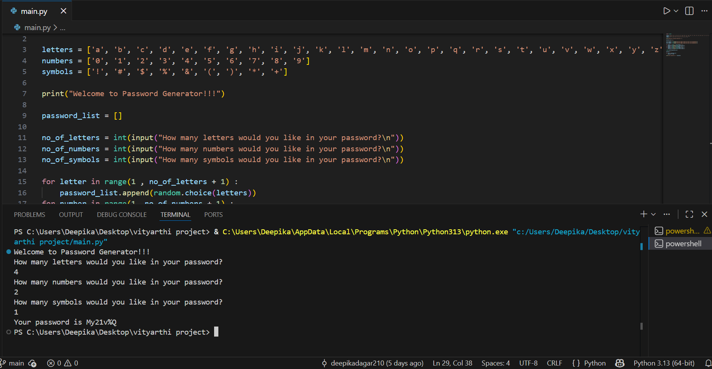

# Password Generator #

A simple and clean password generator that creates strong random passwords with just one click.

## Features ##
* Generate secure passwords instantly
* Choose length and character types
* Easy-to-use interface

## How to Use ##

1. Open the project folder    
2. Run main.py in terminal   
3. Enter the number of letters, numbers and symbols in your password

## Demo ##

